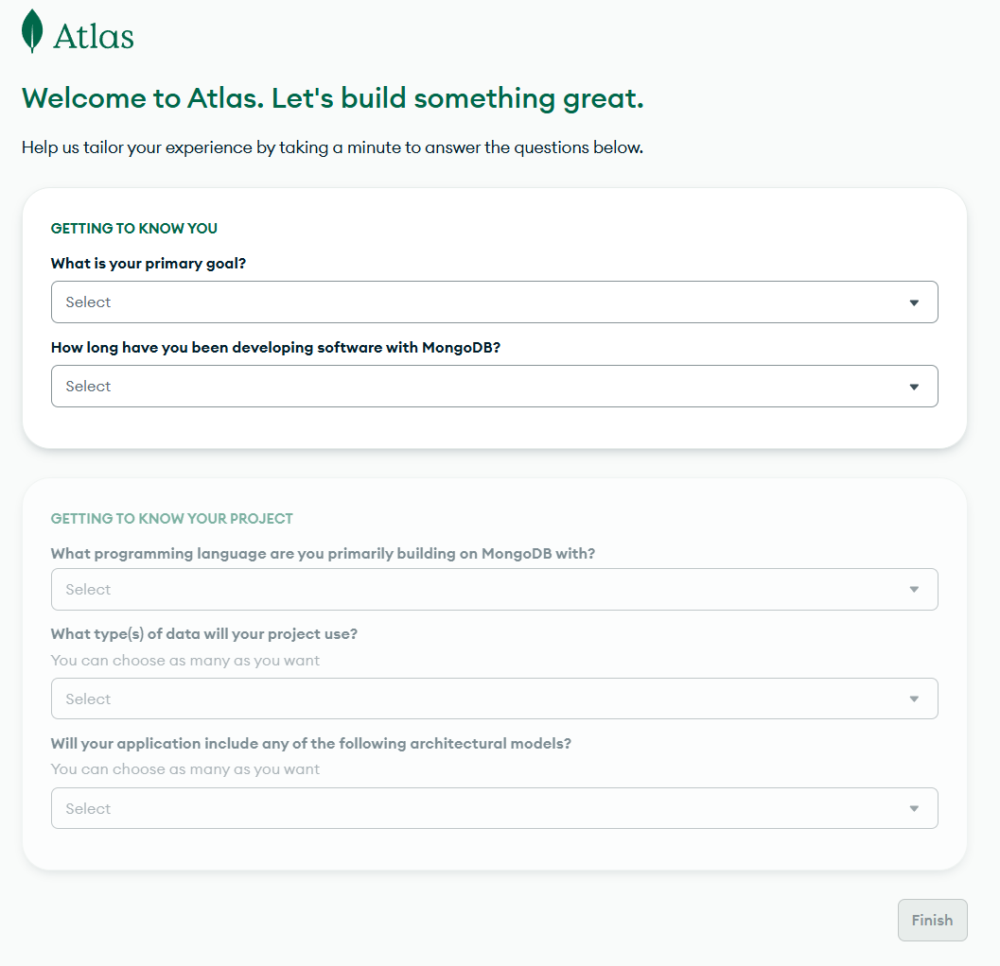

# Getting Started with MongoDB

This section will walk you through setting up a MongoDB account, database, and collections from scratch.
If you already have a MongoDB account and database set up, you can skip this section!

MongoDB does a great job supporting their product, which also means that UI elements and features may change over time.
If something looks different from what is described here, please use your best judgement and try to find the equivalent
feature in the current version of MongoDB.  If free tier options have changed, please let me know, so I can update this!

---

## Create a MongoDB Account

1. Go to the [MongoDB registration website](https://www.mongodb.com/cloud/atlas/register).
2. Enter your name, email address, create a strong password, and agree to the terms of service.  Please note that you
will need to verify your email address before you can proceed.

3. Answer the questionnaire about your experience with MongoDB and click "Finish".  This may not be required
for all users.  If you have the option, you should choose "Python" as the primary programming language, "Inventory"
as the type(s) of data, and "Mobile" as the application type.

4. You should now select the "M0" cluster tier.  This is the free tier and should be sufficient for most individual
use cases.  Configure whatever cluster name you want, where it's hosted, and de-select the "Preload sample dataset"
option.  For this walkthrough I have left all values as their default except for unchecking "Preload sample dataset".
When you're satisifed with your selections, click "Create Deployment".

5. Record any information in the pop-up Security Setup window.  This will be important, as it creates a new user with
admin privileges.  If you accidentally clicked off of this page like I did, it's not the end of the world as I'll now
show you how to create a new user with the required permissions and then finally how to set up your first database.

## Create a New User
